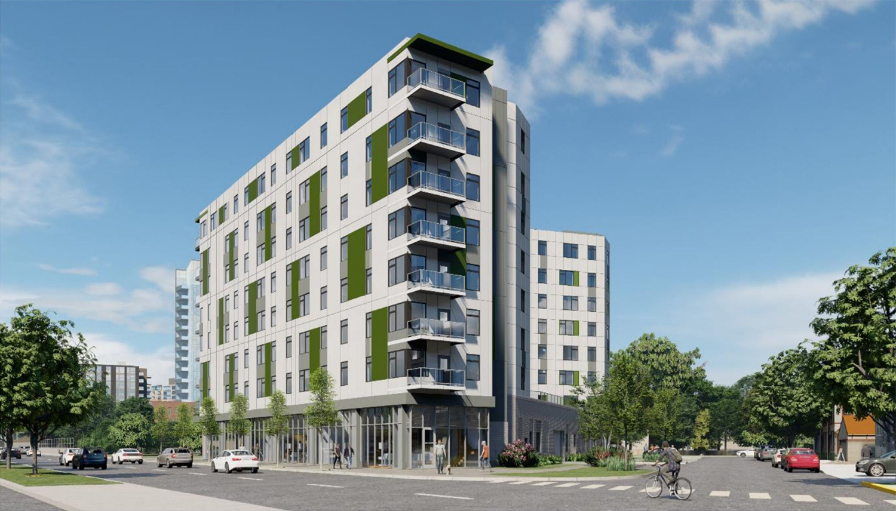

#   Apartment Management Platform
This project is designed to manage an apartment rental platform. It allows adding, editing, deleting, and viewing apartments, as well as filtering them by price and number of rooms. The stack includes **Node.js**, **Express**, **MongoDB** for the backend, and **React** with **Redux Toolkit** for the frontend.

<p>
<hr/>
 

<a href="https://www.npmjs.com/package/express" target="_blank"></a>
<a href="https://www.npmjs.com/package/express" target="_blank"></a>
<a href="https://www.npmjs.com/package/express" target="_blank"></a>

<p>Description</p>
## Features

- **Add Apartment**: A form to submit apartment details (title, description, price, number of rooms, photos).
- **Edit Apartment**: Ability to modify apartment details.
- **Delete Apartment**: Ability to remove an apartment from the system.
- **View Apartment List**: View all apartments added to the database.
- **Filters**: Filter apartments by price and number of rooms.

## Technologies

- **Frontend**:
    - React (with TypeScript)
    - Redux Toolkit
    - Axios for API calls
- **Backend**:
    - Node.js
    - Express.js
    - MongoDB for data storage

## Setup Instructions

### 1. Clone the repository

Clone the repository to your local machine:

```bash
$ git clone https://github.com/ivan-andriichak/nitrix_platform.git
cd nitrix_platform
```

### 2. Run the Application

### Backend:

```markdown
 cd backend
 npm install
 npm run start:dev
```

### Frontend:

```markdown
cd frontend
npm install
npm run build 
npm run dev-react 
```

## Testing

Make sure to test your application locally after setting up both the frontend and backend. Use Postman or any API client to test the API endpoints.

